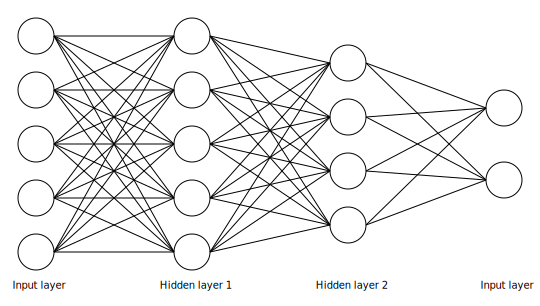

This post is for people who understand neural networks and the convolution operation for vectors, matrices, and/or tensors, and want to understand how convolutional neural networks work. There are 3Blue1Brown videos on both [neural networks](https://youtu.be/aircAruvnKk) and [convolutions](https://youtu.be/KuXjwB4LzSA), which should provide enough background for this post to make sense. If you already understand CNNs, maybe this post can still offer a new way to think about them or crystalize some ideas you already have.

<!-- The idea for this post came about while I was learning about C.J. Shallue and Andrew Vanderburg's[^shallue-vanderburg-2018] `astronet` model for detecting transiting exoplanet candidates in data from NASA's Transiting Exoplanet Survey Satellite (TESS). If you want to try to figure out the central idea for this post before reading on, you should watch [this excellent 3Blue1Brown YouTube video on convolutions](https://youtu.be/KuXjwB4LzSA) and read section 2 of their [paper](https://doi.org/10.3847/1538-3881/aa9e09). It will help to already have an existing understanding of neural networks (at least fully-connected ones). -->

<!-- Generally, it will be helpful to know how neural networks and convolutions work in order to read this article. 3Blue1Brown has videos on both ([convolutions](https://youtu.be/KuXjwB4LzSA), [neural networks](https://youtu.be/aircAruvnKk)) that should give sufficient background. -->

## Neural Networks

Neural networks transform data by passing it through a series of layers. Each layer has a vector of inputs, a vector of outputs, and connections between them of different strengths: some connections are more important than others. We are not concerned with figuring out what the best strengths are; only in how the network passes data forward through this series of transformations.

*Neural network transformation layers*

These layers are called *fully connected*, since every entry of the input vector is connected to every entry of the output vector. Mathematically, if we have an input vector $\mathbf{x}$ and an output vector $\mathbf{y}$ for a layer, then $\mathbf{x}$ and $\mathbf{y}$ are related via a *weight matrix* $W$, *bias vector* $\mathbf{b}$, and elementwise *nonlinearity* $\phi$, in what we will call the *layer equation*:
$$
\mathbf{y} = \phi(W\mathbf{x} + \mathbf{b}).
$$

Fully connected neural networks connected scalars in each layer. Convolutional neural networks (specifically, convolutional layers in CNNs[^pooling-layers]) generalize this idea by connecting vectors, matrices, or higher tensors. This allows CNNs to leverage local and spatial structure in data, and viewing the convolution operation as a generalization of multiplication gives an elegant formulation of the underlying mathematics.

## Local and spatial structure

Quoting Shallue and Vanderburg[^shallue-vanderburg-2018] from their paper on their `astronet` model for detecting exoplanets (which uses a convolutional architecture),
> Fully connected neural networks, which densely connect every neuron in layer $n$ to every neuron in layer $n + 1$, ignore any spatial structure present in the input. For example, every pixel in a 2D input image would be treated independently without using the fact that some pixels are located near each other. Features that are composed of neighboring pixels, like edges and shapes, need to be learned independently by the model for each location in the input. By contrast, convolutional neural networks (CNNs) exploit spatial structure by learning local features that are detected across the entire input; each feature only needs to be learned once. This significantly reduces the number of parameters that the model needs to learn, and reduces the memory usage and number of computational operations required to compute the output.

Whereas fully connected layers connect two vectors, whose entries are scalars, convolutional layers connect vectors whose entries are themselves vectors, matrices, or even arbitrary tensors (higher dimensional arrays of data)[^vector-of-tensors-formalism]. The "strength," or *weight* of the connections are also vectors/matrices/tensors, and all these weights together form a matrix of vectors/matrices/tensors. (Similarly for the vector of biases, which contains vectors/matrices/tensors.)

![Convolutional layer connecting matrices]

Concretely, suppose we are connecting matrices which represent pixels in an image. We can zoom in on one of the connections between an input image and an output image.

![Connections to an output pixel]

The connection is "carried out" by convolving the input image with a matrix which we previously called the "strength of the connection," but which is usually called the *kernel*. This effectively connects each output pixel to a group of input pixels centered around the corresponding location in the input image. This group of input pixels is the same size and shape as the kernel.

Locality comes from these connections — output pixels are only connected to input pixels from the corresponding regions of input images. That is, the value of an output pixel only depends on input pixels in similar image-regions. A good exercise is to work through/draw a similar example for vectors, like time series, or tensors.

![All connections from inputs pixels to one output pixel]

This is also how CNNs reduce the total number of connections in the network — rather than connecting every input pixel to every output pixel, only pixels in similar locations are connected. So, CNNs are well-suited for data with spatial structure, but less well-suited for data structured in other ways, like one-hot representations or collections of separate scalar features. If there is a reason your data is structured in arrays, matrices, or tensors, there is a good chance CNNs will be effective.

## The layer equation for tensors

If $\mathbf{x}$, $\mathbf{y}$, $W$, and $\mathbf{b}$ all contain vectors/matrices/tensors instead of tensors, how can we evaluate the layer equation to transform input data? Expanding the layer equation, we have (assuming $\dim \mathbf{x} = n$)
$$
y_i = \phi \left( \sum_{j = 1}^n w_{ij}x_j + b_i \right)
$$
for each entry $y_i$ of $\mathbf{y}$. For the fully connected case, $x_j$, $y_i$, $w_{ij}$, and $b_i$ are all scalars. If they are all vectors/matrices/tensors, then most of this equation still makes sense, since addition of vectors/matrices/tensors is perfectly well defined (as long as appropriate dimensions match) and we can apply $\phi$ elementwise to any vector, matrix, or tensor.

The only complication is that we need to perform the multiplication $w_{ij}x_j$. This is defined for some matrices, with rather strict conditions on dimensions — in CNN applications, $w_{ij}$ and $x_j$ will almost never have compatible dimensions. However, there is no usual definition for vectors or higher tensors.

As suggested in the [3B1B convolutions video](https://youtu.be/KuXjwB4LzSA), we can use convolution as a generalization of multiplication. So, our expanded layer equation becomes
$$
y_i = \phi \left( \sum_{j = 1}^n w_{ij} * x_j + b_i \right).
$$
Note that convolution of scalars is just multiplication, so this is really a generalization of the layer equation, not something wholly new. In this equation, $w_{ij} * x_j$ creates the connections between $x_j$ and $y_i$, so summing over $j$ ensures that $y_i$ is connected to all input "images."

<!-- I won't go through the details of how $w_{ij} * x_j$ creates the connections discussed above, and I think it's a good check for understanding of the convolution operation to work through those details if it doesn't make sense. Keep in mind that $w_{ij} * x_j$ creates the connections between "pixels" in $x_j$ and $y_i$, and that summing over $j$ gives connections from all input vectors/matrices/tensors to $y_i$. -->

A quick note on dimensions: as noted, generally $w_{ij}$ is small, so $x_j$ and $y_i$ are close in dimension[^convolution-dimension]. In some cases, it is useful to truncate $y_i$ to be *exactly* the same dimension as $x_j$ (e.g., to output an image of the same size as the input images). Looking at the dimensions of $x_j$, $w_{ij}$, $b_i$, and $y_i$, there are only two degrees of freedom: given the dimensions of any two, the dimensions of the other two can be deduced[^dimension-freedom-justification].

## Summary

There are basically three ideas here:
- Convolution generalizes multiplication from scalars to tensors.
- Convolutional layers use convolutions to connect tensors in the same way that fully connected layers connect scalars.
- The connections in convolutional layers leverage spatial structure to be more efficient, but do not perform as well with data that lacks spatial/local structure.

[^shallue-vanderburg-2018]: Shallue, C. J., & Vanderburg, A. (2018). Identifying Exoplanets With Deep Learning. *The Astronomical Journal, 155*, 94–114. [https://doi.org/10.3847/1538-3881/aa9e09](https://doi.org/10.3847/1538-3881/aa9e09)
[^pooling-layers]: CNNs also use *pooling layers* to make the network invariant to small shifts in the input data, but these are conceptually much simpler and not my focus here.
[^vector-of-tensors-formalism]: If you're concerned about formalism or implementation, a "vector of vectors/matrices/tensors" is just a tensor with an extra dimension. A "matrix of vectors/matrices/tensors" is a tensor with two extra dimensions.
[^convolution-dimension]: For vectors, $\dim y_i = \dim x_j + \dim w_{ij} - 1$; for matrices/tensors, this holds along each axis.
[^dimension-freedom-justification]: This follows immediately from the previous footnote and the fact that $y_i$ and $b_i$ have the same dimension.
