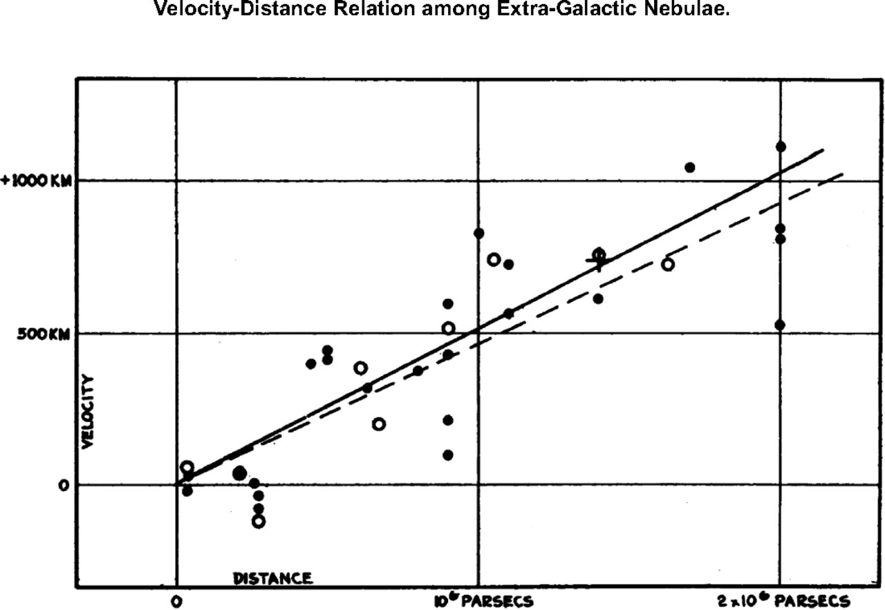
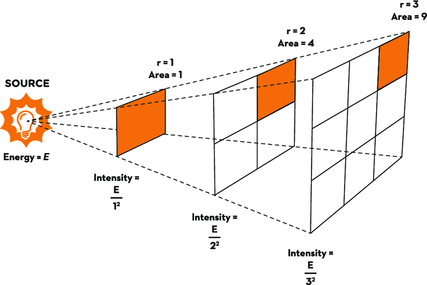

## Introduction

Edwin Hubble's 1929 paper[^hubble-1929] relating recession velocity and distance of galaxies shocked the scientific community. Until then, the assumption that our universe was static in scale had gone unquestioned; indeed Einstein famously included the "cosmological constant" in his field equations of general relativity to make them agree with this premise. However, Hubble's observations demonstrated a direct correlation between a galaxy's distance from Earth and the speed at which it was moving away from the Earth, implying that the universe was expanding in scale.

Hubble's law is simple to state:
$$
v = H_0 d,
$$
where $v$ is velocity, $d$ is distance, and $H_0$ is the so-called Hubble constant. Due to this linear relationship, $H_0$ represents the slope of the line shown in the velocity-distance graph below, and attempts to find the exact value of $H_0$ have led to excellent developments in observational cosmology. Critically, this slope is nonzero, so galaxies are not only moving away from Earth but are also moving away from each other. The linear distance-speed relationship also implies that recession speed from Earth grows exponentially over time, implying that something more at play than galaxies maintaining their velocity as dictated by Newton's first law.

*Velocity-distance relation among extra-galactic nebulae[^hubble-1929].*

## Estimating $H_0$

Determining the exact value of $H_0$ has several implications, a notable example being the age of our universe. Under the assumption that our universe began in a "big bang," one can infer the age of the universe from its current scale and its rate of expansion in the same way one would estimate driving times based on distance and average speed.

Hubble originally obtained a value of 500 km/s/Mpc for $H_0$, but by 1992 the best estimates were 50 to 100 km/s/Mpc and today these measurements have converged to 69 to 73 km/s/Mpc[^freedman-1992][^riess-et-al-2016]. These modern estimates put the age of the universe between 12 and 14.5 billion years, with higher values of $H_0$ corresponding to a younger universe, for the same reason that driving faster reduces the time taken on a road trip[^schombert-mcgaugh-lelli-2020].

Interestingly, the discrepancy in measured values of $H_0$ persists even with increasingly precise measurement techniques. The error margins are now low enough that the difference is statistically significant; that is, one would not expect to have such a large difference based on the error bounds for present-day measurement techniques. This disparity is known as the Hubble tension and is a pressing issue in contemporary cosmology.

How, then, would one go about actually finding a value for $H_0$? Rearranging slightly, we see that $H_0 = v / d$, so the necessary measurements are speed and distance to galaxies. Of the two, speed is far more easily and consistently measured. To measure speed, astronomers exploit the Doppler effect: an object's velocity relative to the observer affects the frequency of waves emitted by the object. The classic example is a car passing a stationary observer, creating a "NYOOOM" sound as the sound waves become very short and then rapidly elongate once the car passes the observer.

In light waves, the effect of this elongation is a "reddening" of the light, since red waves have lower frequency. For this reason, the effect is often called redshift (or sometimes blueshift, if the emitting object is moving towards the observer) in the case of light waves. Astronomers can measure the amount of redshift, from which the exact velocity of the emitting object can be inferred as long as the true frequency is known.

Because astronomers have a solid understanding of the physics and chemistry taking place in galaxies, they can accurately predict the true spectrum of a galaxy -- that is, the distribution of wavelengths observed in light collected from a galaxy. By comparing these theoretical spectra to the observed spectra, it is possible and even straightforward to quantify a galaxy's redshift, whence its recessional velocity can be inferred. Thus Hubble's law says that redshift is linearly proportional to distance; this is how experimental values can be obtained.

## Measuring Celestial Distances

Distance, on the other hand, is a far tricker measurement. The only concrete measurement astronomers can take is how bright an object appears from Earth. Trying to relate this to distances, one initial observation is that a star's brightness is inversely proportional to its distance from Earth. This is an instance of the inverse square law, which states that the intensity of radiation spreading evenly in all directions is proportional to $1 / d^2$, where $d$ is the distance to the source.

*Visual representation of the inverse-square law[^simmons-et-al-2017].*

Unfortunately, this relationship, even combined with the perceived brightness of a galaxy, is useless without the luminosity, or true brightness, of the galaxy. The challenge is thus to find objects whose luminosity can be determined by other means. Hubble's original calculations[^hubble-1929] used *Cepheid variables*. These are stars with periodic luminosity: increasing rapidly when internal pressure causes swelling and higher surface area and slowly falling as gravity pulls the star back in and the surface area declines.

It turns out that this relationship between surface area and luminosity is key. Henrietta S. Leavitt of Harvard College Observatory discovered in 1908 that the brightness of Cepheids is tightly related to their period for precisely this reason[^freedman-1992]. By observing the average brightness and period of a Cepheid, astronomers can therefore compute its average absolute luminosity. Comparing this with its average brightness and applying the inverse square law is then enough to deduce the distance to the Cepheid, giving exactly the measurement we were looking for! Cepheids remain the most consistent method for measuring distances at cosmological scales and are still used today to test new methods being developed for accuracy whenever possible.

Since Hubble's time, astronomers have developed many new methods for measuring distances, giving the precise values mentioned earlier for $H_0$. Wendy Freedman's "The Expansion Rate and Size of the Universe"[^freedman-1992] provides an excellent survey of the methods as of 1992; the major change since that time is the use of Type Ia supernovae. These supernovae allow measurements of up to 1000 Mpc, a substantial improvement over the roughly 50 Mpc limit of Cepheid variables. A more comprehensive explanation of Type Ia supernovae as well as a discussion of their uses and limitations can be found in Hogan, Kirshner, & Suntzeff's "Surveying Space-time with Supernovae"[^hogan-kirshner-suntzeff-1999].

## The Big Bang

Given the surprising fact that the universe is expanding its scale and that galaxies are moving away from one-another at ever-increasing speeds, a natural question is *why* the universe is this way -- gravity is an attractive force between all objects in the universe, so one would expect that the universe would slowly collapse in on itself. To answer this question, we must go back to the very beginning: the big bang.

The big bang was first theorized in the 1920s as an explanation for new evidence that the universe was expanding, including Einstein's theory of general relativity and Hubble's observations. However, the most compelling evidence in support of the theory wasn't observed until 1965 by Arno Penzias and Robert Wilson, after being predicted 17 years earlier by Ralph Alpherin[^NASA-WMAP-2016]. This evidence comes in the form of *cosmic background radiation*, photons emitted several hundred thousand years after the big bang that still permeate the universe today.

Cosmic background radiation is important because patterns in its density reveal structures present early in the universe. Small fluctuations in energy density shortly after the big bang would eventually become the astronomical structures we see today. As noted before, it also provides evidence for the big bang: such radiation is extremely unlikely to exist if it was not produced by some extraordinary even at the scale of the big bang. However, scientists have observed its effect with extreme accuracy and have even been able to measure fluctuations in its effect. The big bang theory elegantly explains cosmic background radiation and Hubble's law, as well as being consistent with general relativity, and for these reasons, it is by far the best theory we have for the origin of our universe.

[^freedman-1992]: Freedman, W. L. (1992). The Expansion Rate and Size of the Universe. _Scientific American_, _267_(5), 54–61.

[^hogan-kirshner-suntzeff-1999]: Hogan, C. J., Kirshner, R. P., & Suntzeff, N. B. (1999). Surveying Space-time with Supernovae. _Scientific American_, _280_(1), 46–51.

[^hubble-1929]: Hubble, E. (1929). A Relation Between Distance and Radial Velocity Among Extra-Galactic Nebulae. *Proceedings of the National Academy of Sciences, 15*(3), 168–173. [https://doi.org/10.1073/pnas.15.3.168](https://doi.org/10.1073/pnas.15.3.168)

[^NASA-WMAP-2016]: NASA/WMAP Science Team. (2016, May 9). *Tests of Big Bang: The CMB*. [https://wmap.gsfc.nasa.gov/universe/bb_tests_cmb.html](https://wmap.gsfc.nasa.gov/universe/bb_tests_cmb.html)

[^riess-et-al-2016]: Riess, A. G., Macri, L. M., Hoffmann, S. L., Scolnic, D., Casertano, S., Filippenko, A., Tucker, B. E., Reid, M. J., Jones, D. O., Silverman, J. M., Chornock, R., Challis, P., Yuan, W., Brown, P. J., & Foley, R. J. (2016). A 2.4% Determination of the Local Value of the Hubble Constant. *The Astrophysical Journal, 826*(1), 56–86. [https://doi.org/10.3847/0004-637X/826/1/56](https://doi.org/10.3847/0004-637X/826/1/56)

[^schombert-mcgaugh-lelli-2020]: Schombert, J., McGaugh, S., & Lelli, F. (2020). Using the Baryonic Tully-Fisher Relation to Measure $H_0$. *The Astronomical Journal, 160*(2), 71–79. [https://doi.org/10.3847/1538-3881/ab9d88](https://doi.org/10.3847/1538-3881/ab9d88)

[^simmons-et-al-2017]: Simmons, S., Dale, C., Holt, J., Velasquez, K., & Stibich, M. (2017). Role of Ultraviolet Disinfection in the Prevention of Surgical Site Infections. In S. Ahmad (Ed.), *Ultraviolet Light in Human Health, Diseases and Environment* (pp. 255–266). Advances in Experimental Medicine and Biology, vol 996. Springer, Cham. [https://doi.org/10.1007/978-3-319-56017-5_21](https://doi.org/10.1007/978-3-319-56017-5_21)
