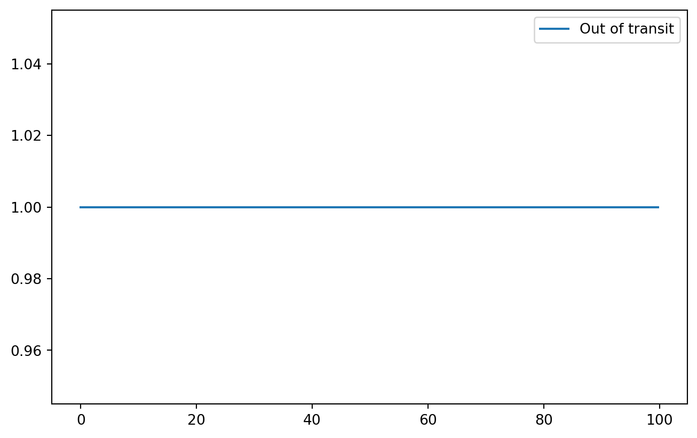

I've been doing some work recently that required injecting transiting planet signals into light curves. This lead me to thinking about what kind of signal to use, since there are many different transit signal models. They range from the box functions used in BLS (box least squares) searches, to full astrophyical models derived by Mandel and Agol (2002). In this post I want to show how these models work, how they build in complexity, and give an idea of how you might come up with these models.

## Terminology

-   **Transit model:** a function of time that gives the amount of light predicted to be observed from a star with a planet orbiting and passing in front of it.
-   **In-Transit:** points on a light curve at times when the planet is between the star and the observer.
-   **Out-of-transit:** points on a light curve at times when there is nothing between the star and the observer.

``` python
import matplotlib.pyplot as plt
import numpy as np

def constant_model(t: np.ndarray) -> np.ndarray:
    return np.ones(t.shape)

t = np.arange(100, step=0.2)
y = constant_model(t)
plt.plot(t, y, label="Out of transit")
plt.legend()
plt.show()
```



## Box Functions

The simplest transit model is a box function, which takes on a constant high value for out-of-transit points and a constant low value for in-transit points.
